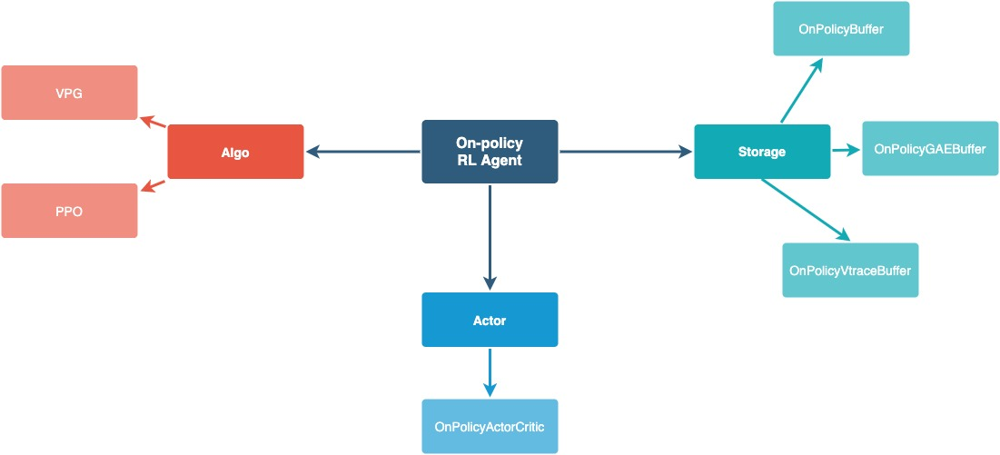
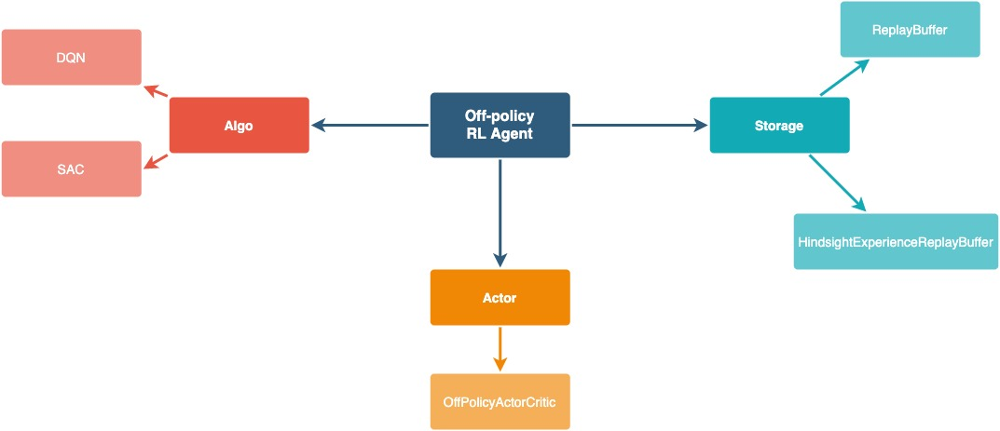

Getting started
===============

Running experiments with NAPPO takes 4 simple steps.

1. Define a RL agent
--------------------

NAPPO subscribes the idea that composable agents are the best option to enable method experimentation. Individual components are easier to read, understand and modify. They also allow for method flexibility, as they can be combined in different ways.

NAPPO distinguishes between 4 types of core components: the ``Env``, the source of data, the ``Algo``, which manages loss and gradient computation, the ``Actor``, implementing the deep neural networks used as function approximators, and the ``Storage``, which handles data storage, processing and retrieval. Selecting an instance of each class and combining them we can create an agent.

Our current implementation contains the following components.

New components can be created and combined with already existing ones. For more information about how to do it, see :ref:`Create a custom component`.

For our example, we can create an On-Policy Agent, using the Proximal Policy Optimization (PPO) algorithm, a Storage with Generalized Advantage Estimation (GAE) and an Actor Critic using MLP networks as feature extractors.

.. code-block:: python

    from nappo.core.algos import PPO
    from nappo.core.storages import OnPolicyGAEBuffer
    from nappo.core.actors import OnPolicyActorCritic, get_feature_extractor

    # Define RL Actor
    actor_factory = OnPolicyActorCritic.create_factory(
    obs_space, action_space, feature_extractor_network=get_feature_extractor("MLP"))

    # Define RL training algorithm
    algo_factory = PPO.create_factory(
        lr=1e-4, num_epochs=4, clip_param=0.2, entropy_coef=0.01,
        value_loss_coef=.5, max_grad_norm=.5, num_mini_batch=4,
        use_clipped_value_loss=True, gamma=0.99)

    # Define rollouts storage
    storage_factory = OnPolicyGAEBuffer.create_factory(size=1000, gae_lambda=0.95)

.. note::
    Being able to scale to distributed regimes can require RL agent components to be instantiated multiple times in different processes. To do that, all NAPPO core components contain a specifically named class method, called ``create_factory``, which returns a function allowing to create component instances, a ``component factory``.

    Instead of directly defining a single RL agent instance, we can define a ``component factory`` for each component and pass them on to the training architecture component called ``Scheme``, which will handle the creation of any training architecture we specify later on.

We also need to define an environment for the agent to interact with. However this a somewhat special type of component, because we would normally want multiples coipes of it. More specifically, we would normally want to stack multiple independent environments copies into a single one to make a more efficient use of compute resources during inference time.

To do that, we start defining an ``env_factory``, a function that creates single copies of the environment under consideration. NAPPO already contains some basic environments, such as ``Pybullet``, ``Atari`` and ``MuJoCo``, so we can import one of those.

.. code-block:: python

    from nappo.envs import pybullet_train_env_factory

Nonetheless, here we have a slightly simplified version of the code we just imported. The complete version can be found `here. <https://github.com/nappo/nappo/blob/master/nappo/envs/pybullet/make_pybullet_env.py>`_

.. code-block:: python

    import gym
    import pybullet_envs

    def pybullet_train_env_factory(env_id, seed=0):
        env = gym.make(env_id)
        env.seed(seed)
        return env

As we can see, the function returns a ``gym.Env`` instance, so defining a version of this function for any other environment adapted to work with the OpenAI Gym interface is straightforward. Any ``gym.Wrappers`` can be added here as well. We can even define a different ``env_factory`` for training and for testing our RL agent, with different wrappers in each one.
Following, we can create a vectorized environment with the ``VecEnv`` component, which takes in the ``env_factory``, any ``kwargs`` we want to define for it, and the number of copies we want to stack together.

.. code-block:: python

    from nappo.core.env import VecEnv

    # Define Environment Vector
    train_envs_factory, action_space, obs_space = VecEnv.create_factory(
        vec_env_size=1,
        log_dir="/tmp/train_example",
        env_fn=make_pybullet_train_env,
        env_kwargs={"env_id": "HalfCheetahBulletEnv-v0"})

.. note::
   The ``VecEnv`` class accepts an optional parameter called ``log_dir``. If provided, a ``gym.Monitor`` wrapper will be used to generate json log files for each individual environment in the vector.

3. Customize training scheme
----------------------------

Deep RL algorithms are generally based on the repeated execution of three sequentially ordered operations: rollout collection (R), gradient computation (G) and policy update (U). In single-threaded implementations, all operations are executed within the same process and training speed is limited by the performance that the slowest operation can achieve with the resources available on a single machine. Furthermore, these algorithms don't have regular computation patterns (e.i. while rollout collection is generally limited by CPU capacity, gradient computation is often GPU bounded), causing an inefficient use of the available resources.

To alleviate computational bottlenecks, we can parallelize operation or even asynchronously execute consecutive operations. Even within the computational budged of a single machine, this solution enables a more efficient use of compute resources at the cost of some deviation from the original problem formulation. Furthermore, if actors can communicate across a distributed cluster, this approach allows to leverage the combined computational power of multiple machines. NAPPO handles creation and coordination of actors using Ray distributed framework.

Nappo contains a distributed component called ``Scheme``, that allows to define the training schemes.

.. code-block:: python

    from nappo.schemes import Scheme

    # Core components params
    scheme_parameters = {
        "algo_factory": algo_factory,
        "actor_factory": actor_factory,
        "storage_factory": storage_factory,
        "train_envs_factory": train_envs_factory}

    # Collection operation params
    scheme_parameters.update({
        "col_remote_workers": 0, # only local workers
        "col_communication": "synchronous"})

    # Gradient computation operation params
    scheme_parameters.update({
        "grad_remote_workers": 0, # only local workers
        "col_communication": "synchronous"})

    scheme = Scheme(**scheme_parameters)
    
4. Execute training loop
------------------------

Finally, another class, called the ``Learner``, helps us defining the training loop. The ``Learner`` class takes as input parameters, the ``Scheme``, the target number of steps to train and, optionally, a path where to store the training logs ``log_dir``.

.. code-block:: python

    from nappo import Learner

    # 6. Define learner
    learner = Learner(scheme, target_steps=1000000, log_dir="/tmp/train_example")

    # 7. Define train loop
    iterations = 0
    while not learner.done():
        learner.step()
        if iterations % 1 == 0:
            learner.print_info()
        if iterations % 100 == 0:
            save_name = learner.save_model()
        iterations += 1

5. Check results
----------------

Results include monitor files, saved models and tensorboard logs

